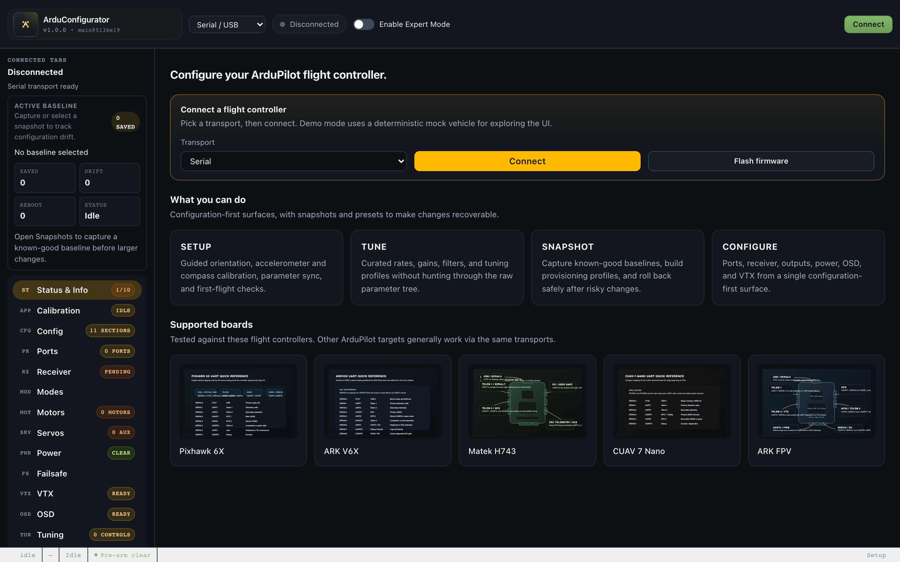
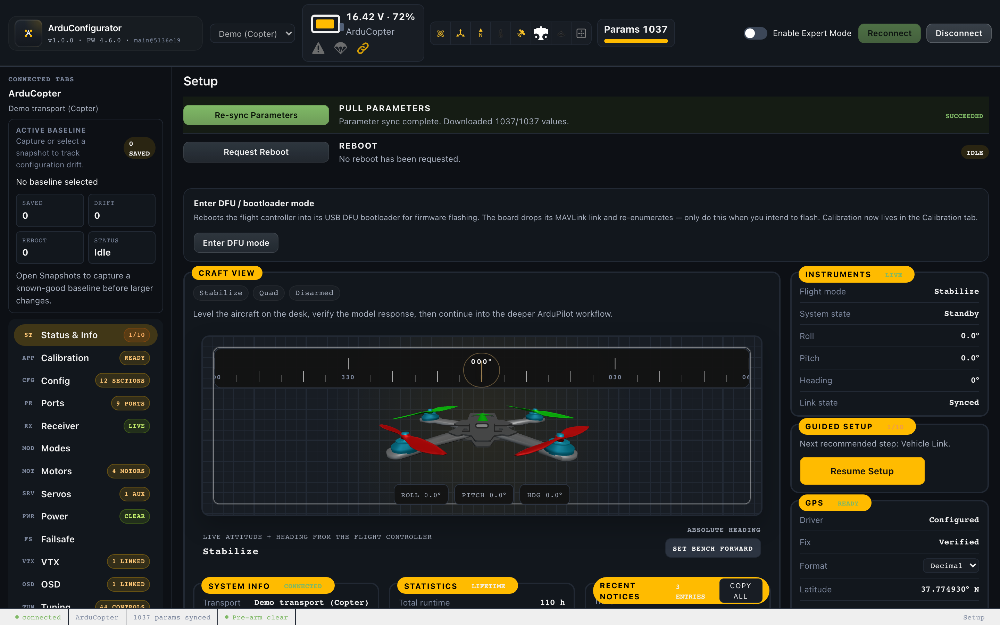

# ArduConfigurator

A browser-first configurator for ArduPilot, focused on setup and configuration for FPV multirotors. It targets the same workflow space as `app.betaflight.com`, but for ArduPilot — a guided, configuration-first experience rather than a raw-parameter editor or a general-purpose ground station.

**Live app:** <https://arduconfigurator.com> — runs a bundled in-browser mock runtime, so you can explore the full interface with no hardware connected.

## Preview

Pre-connect landing:



Connected setup view:



## Project layout

This is a TypeScript npm-workspaces monorepo.

| Workspace | Responsibility |
| --- | --- |
| `apps/web` | React/Vite browser UI (the primary surface) |
| `apps/desktop` | Electron shell, native serial, WebSocket bridge, CLI tools |
| `packages/transport` | Transport adapters: mock, Web Serial, WebSocket, replay |
| `packages/protocol-mavlink` | MAVLink v2 codec, session layer, DroneCAN codec |
| `packages/firmware-flash` | `.apj` parsing, ArduPilot bootloader client, firmware manifest |
| `packages/param-metadata` | Parameter metadata catalogs, grouped views, presets |
| `packages/ardupilot-core` | Runtime state machine: sync, writes, guided actions, snapshots |
| `packages/ui-kit` | Shared presentational React primitives |
| `packages/mock-sitl`, `packages/sitl-harness` | Deterministic mock harness and true-SITL utilities |

## Quick start

```bash
npm install        # install dependencies
npm run dev:web    # web app dev server
npm run typecheck  # typecheck every workspace
npm run test       # build workspaces + unit suite
npm run test:e2e   # Playwright end-to-end suite
```

Desktop shell against the built app: `npm run desktop:app`. True-SITL validation against a local ArduPilot checkout: `ARDUPILOT_REPO_PATH=/path/to/ardupilot npm run test:sitl`.

## Validation

Changes are validated on the lowest rung that proves them: mock runtime → recorded-session replay → Playwright end-to-end → true ArduPilot SITL → live flight controller. CI runs typecheck, the unit suite, and the end-to-end suite on every pull request.

## Safety

- Treat a connected flight controller as a real aircraft.
- Validate read-only first; snapshot before risky writes.
- Never run a motor test with propellers installed.

## Documentation

- [CONTRIBUTING.md](CONTRIBUTING.md) — workflow and validation expectations
- [RELEASING.md](RELEASING.md) — tagging and packaging
- [SECURITY.md](SECURITY.md) · [SUPPORT.md](SUPPORT.md) · [CODE_OF_CONDUCT.md](CODE_OF_CONDUCT.md)

## Credits

ArduConfigurator builds on the original [ArduConfigurator by jb-01](https://github.com/jb-01/ArduConfigurator). UI assets are adapted from [Betaflight Configurator](https://github.com/betaflight/betaflight-configurator) and [QGroundControl](https://github.com/mavlink/qgroundcontrol) — see the bundled `ATTRIBUTION.txt` files for full provenance.

## License

[GNU GPL v3.0 only](LICENSE). The rotating craft preview models in [apps/web/public/models](apps/web/public/models) are from the Betaflight Configurator project under GPL-compatible terms — see the bundled `ATTRIBUTION.txt` files for full provenance.
